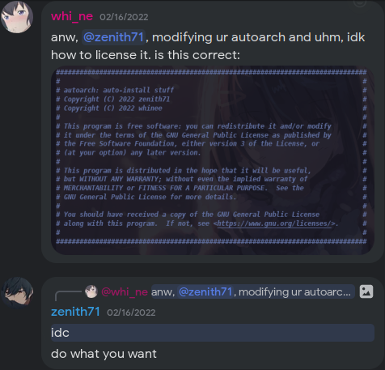

<div align = center>

<h1>Autoarch</h1>

<br>

[![Badge License]][License] 
![Badge Lines] 
![Badge Language] 
[![Badge Pull Requests]][Pull Requests] 
[![Badge Issues]][Issues] 

<h3>Auto installer for my Arch</h3>

---

A highly customized Arch Linux auto-installer script for my Arch

Automatically setup with btrfs and my [dotfiles](https://github.com/newbee1905/dotfiles)

---

<br>

</div>

# Important

## *WIP*

This project is still a work-in-progress.

## *Warning*

As stated on the original repository, this project, and thus the script, is tailored towards the developer's needs. Feel free to fork if your needs differ from the developers'.

## *License*

For concerns regarding the legality and validity of the License, I got a written permission from the author to quote:

<details>
<summary><blockquote cite="https://discord.com/channels/931186431215435807/942523450927493121/943511320135860335">do what you want</blockquote></summary>



</details>

If you know how to properly attribute the original author of the script, please raise a new issue or create a new pull request. It is highly appreciated, thank you!

# Running the script

When you are in the ARCH ISO, run the following command in your terminal screen.


```sh
curl -L github.com/demonkingswarn/autoarch/raw/master/pre.sh|sh -s "passwd"
```
with "passwd" being your password.

</details>

# Contributing

You can contribute by creating a new issue, or by creating pull requests.

At the time of writing, there are no templates for both creating a new issue and pull requests.

The developer notes however that the said template will be created if a trend of users using this project is evident.

# Raising a new issue

Before creating a new issue, please make sure that the said issue is not on the list of closed and open issues.

After checking that that is the case, create a new issue.

The title of the issue must summarize its contents.

The body must contain the following:

- a clear description of the bug
- Python version used for running and/or testing the project
- OS name and version

# License

## GPLv3

## <a target="_blank" href="https://choosealicense.com/licenses/gpl-3.0/">GPLv3</a>

autoarch: auto-install stuff

Copyright (C) 2022 71zenith

Copyright (C) 2022 whinee

Copyright (C) 2022 DemonKingSwarn

Copyright (C) 2022 newbee1905/Kodokuna Hachi

This program is free software: you can redistribute it and/or modify
it under the terms of the GNU General Public License as published by
the Free Software Foundation, either version 3 of the License, or
(at your option) any later version.

This program is distributed in the hope that it will be useful,
but WITHOUT ANY WARRANTY; without even the implied warranty of
MERCHANTABILITY or FITNESS FOR A PARTICULAR PURPOSE.  See the
GNU General Public License for more details.

You should have received a copy of the GNU General Public License
along with this program.  If not, see <https://www.gnu.org/licenses/>.

# **Credits**

## Icons

<a target="_blank" href="https://icons8.com/icon/102502/exclamation-mark">Exclamation Mark</a>, <a target="_blank" href="https://icons8.com/icon/33294/code-fork">Code Fork</a>, <a target="_blank" href="https://icons8.com/icon/85185/star">Star</a>, <a target="_blank" href="https://icons8.com/icon/34095/group">Group</a>, and <a target="_blank" href="https://icons8.com/icon/87276/code">Code</a> icons by <a target="_blank" href="https://icons8.com">Icons8</a>

<sub>
    <i>
        <b>NOTE:</b> If a reference or source material is not attributed properly or not at all, please kindly <a target="_blank" href="https://github.com/whinee/autoarch/issues/new">raise an issue</a> so I can properly give credit to their respective authors.
    </i>
</sub>

<!----------------------------------------------------------------------------->

[Pull Requests]: https://github.com/newbee1905/autoarch/pulls
[Issues]: https://github.com/newbee1905/autoarch/issues
[License]: https://choosealicense.com/licenses/gpl-3.0/

<!----------------------------------{ Badges }--------------------------------->

[Badge Issues]: https://img.shields.io/github/issues/newbee1905/autoarch
[Badge Pull Requests]: https://img.shields.io/github/issues-pr/newbee1905/autoarch
[Badge Language]: https://img.shields.io/github/languages/top/newbee1905/autoarch
[Badge License]: https://img.shields.io/github/license/newbee1905/autoarch
[Badge Lines]: https://img.shields.io/tokei/lines/github/newbee1905/autoarch
